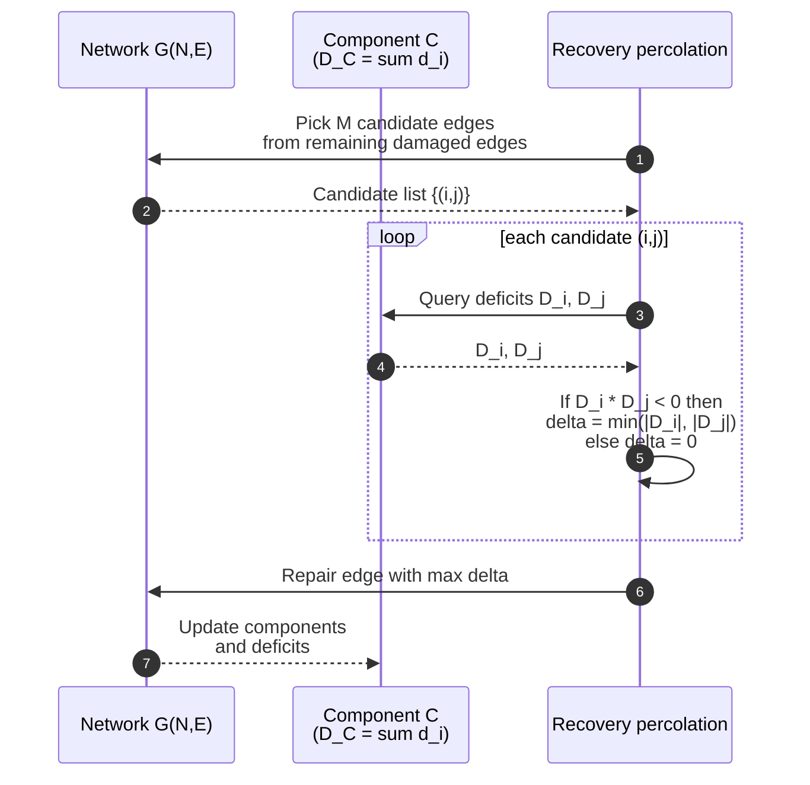

# Smith et al. (2019) 概要メモ

このファイルでは、Smith et al. (2019)
“Competitive percolation strategies for network recovery”
の内容を、論文レベルで整理する。

## 1. 書誌情報

- タイトル: Competitive percolation strategies for network recovery
- 著者:
  - Andrew M. Smith
  - Márton Pósfai
  - Martin Rohden
  - Andrés D. González
  - Leonardo Dueñas-Osorio
  - Raissa M. D’Souza
- 雑誌: Scientific Reports
- 巻・ページ: Vol. 9, Article number: 11843
- 年: 2019 年
- DOI: 10.1038/s41598-019-48036-0
- 簡易 BibTeX（目安）:

```bibtex
@article{Smith2019Competitive,
  title   = {Competitive percolation strategies for network recovery},
  author  = {Smith, Andrew M. and P{\'o}sfai, M{\'a}rton and Rohden, Martin and Gonz{\'a}lez, Andr{\'e}s D. and Due{\~n}as-Osorio, Leonardo and D'Souza, Raissa M.},
  journal = {Scientific Reports},
  volume  = {9},
  pages   = {11843},
  year    = {2019},
  doi     = {10.1038/s41598-019-48036-0}
}
```

## 2. Abstract / 要約

### 2.1 英文 Abstract の要点

- 重要インフラ（特に送電網）の復旧過程を、ネットワーク科学・土木工学・オペレーションズリサーチの観点から解析。
- 問題設定: 大規模災害で損傷したネットワークに対し、
  「どの順番でネットワーク要素（主にリンク）を修復すれば、復旧コストを最小化できるか」。
- 既存アプローチは
  - ネットワーク構造だけを見る単純なトポロジベース（LCC 最大化など）と
  - 需要・供給・フロー制約を含む詳細な最適化モデル（td-NDP）の
  2 極に分かれており、前者は現実性が低く、後者は計算量が大きい。
- 本論文では、両者のギャップを埋めるべく、
  - ノードごとの需要・供給とネットワーク構造を取り込んだ
    **recovery percolation** という競合パーコレーションモデルを提案。
- recovery percolation は
  - 「最大連結成分 (LCC) の成長」ではなく
  - 「供給・需要の不一致（commodity deficit）」の削減を選択基準とすることで、
  現実的な復旧戦略（アイランディングなど）の振る舞いを再現しつつ、
  td-NDP に近い性能を、格段に低い計算量で達成する。

### 2.2 日本語でのざっくり要約

- 復旧対象は、電力送電網を代表とする **単層ネットワーク**（ノード＝変電所、エッジ＝送電線）。
- 各ノードは需要・供給（正負をとる量）を持ち、ネットワークの一部が破壊された状態から
  「1 ステップに 1 本ずつエッジを修復していく」離散復旧過程を考える。
- 復旧コストは主に「需要が満たされていない部分（undersupply）と供給過多（oversupply）のペナルティ」
  に支配されることを、詳細な td-NDP 最適化モデルを通じて示す。
- 通常の「LCC の成長を最優先する」復旧アルゴリズム（LCC percolation）は、
  早い段階で巨大成分をつくるものの、多くの需要ノードが長時間取り残されるため、
  commodity deficit の観点では高コストで非効率であることが分かる。
- そこで、各ステップで複数候補エッジから
  - **需要と供給がつり合う方向に最も commodity deficit を減らすエッジ**を選ぶ
  競合パーコレーション（recovery percolation）を提案する。
- recovery percolationは、Shelby County の送電網や合成電力網を用いた数値実験において、
  - td-NDP のコスト推移をよく近似しつつ、
  - 計算量は O(EM) 程度（td-NDP の指数的複雑さに比べて非常に軽い）
  ことが示される。
- また、合成電力網を用いた解析から、
  - 高い構造的冗長性
  - 長距離リンク
  - 分散した供給ノード
  があるほど復旧効率が高い、といった構造特性とレジリエンスの関係も明らかにされる。

## 3. モデルと仮定（論文ベース）

### 3.1 ネットワーク構造

- グラフ \(G = (N, E)\)
  - ノード集合 \(N\): 変電所・需要ノード・供給ノードを含む電力ノード。
  - エッジ集合 \(E\): 送電線（あるいは一般化されたインフラリンク）。
- 主に扱うネットワーク:
  - 現実の送電網（Shelby County, Tennessee）
  - 合成電力網（Western US grid に類似したトポロジ）
  - 完全グラフ（基礎メカニズムの解析用）
- 単層ネットワークであり、Buldyrev2010 のような多層・相互依存構造は前提としていない。

### 3.2 需要・供給モデル

- 各ノード \(i\) に **commodity demand** \(d_i\) を定義：
  - \(d_i < 0\): 純粋な消費者（需要ノード）。
  - \(d_i > 0\): 純粋な供給者（発電所など）。
  - \(d_i = 0\): ジャンクションノード（単なる通過点）。
- 正規化:
  - 消費・供給の総量が 1 になるように正規化する（\(\sum_i d_i = 1\) など）。
- 復旧過程では、各連結成分ごとに
  - 成分内の \(d_i\) を合計した **commodity deficit** \(D_C = \sum_{i \in C} d_i\) を評価。
  - \(D_C < 0\): 需要過多（undersupply）。
  - \(D_C > 0\): 供給過多（oversupply）。

### 3.3 故障・復旧メカニズム

- 災害直後の状態:
  - 基本ケースとして、「すべてのリンクが損傷したがノードは機能している」という仮定。
  - すなわち \(E' = E\)（全エッジ破壊）、\(N'\) は空集合。
- 復旧過程:
  - 離散時間ステップ t を考え、毎ステップ 1 本の損傷エッジを修復。
  - 復旧が完了するのは、すべてのエッジが修復されたとき（t = |E|）。
- 実際の運用を模した **td-NDP**（time-dependent Network Design Problem）をベンチマークとして用いる：
  - ノード・リンクの修復コスト、運用コスト、需要未満足ペナルティなどを含む混合整数計画。
  - NP-hard であり、ネットワークサイズが大きくなると計算量が爆発する。

### 3.4 競合パーコレーションモデル

- **LCC percolation**
  - 各ステップで M 本の候補エッジをランダム抽出し、
    - LCC のサイズが最大化されるエッジを選んで修復する Achlioptas プロセス。
  - 目的：LCC 成長の最大化。
  - 結果：復旧初期から LCC が急速に大きくなる一方、需要未満足が長く続きコストが高い。
- **Recovery percolation**
  - 各ステップで M 本の候補エッジをランダム抽出し、それぞれを修復したと仮定した場合の
    commodity deficit の改善量 \(\Delta D\) を評価。
  - ノード i, j が属する成分の deficit を \(D_i, D_j\) とすると：
    - \(D_i D_j < 0\)（一方が供給過多、もう一方が需要過多）のとき  
      \(\Delta D = \min(|D_i|, |D_j|)\)（需給ギャップがどれだけ埋まるか）。
    - \(D_i D_j \ge 0\) のとき \(\Delta D = 0\)。
  - M 候補のうち \(\Delta D\) が最大のエッジを修復し、同値のときはランダムに選択。
  - M = 1 ならランダムパーコレーション、M = E なら「毎ステップ最適エッジ」。

## 4. 主な結果・示唆

### 4.1 モデル解析結果・数値結果

- td-NDP 解析から、復旧コストの支配要因は
  - リンク修復コストや運用コストよりも、
  - **需要未満足／供給過多ペナルティ（commodity deficit）**であることが示される。
- LCC percolation と td-NDP の比較では、
  - LCC percolation はグラフ上の連結性を素早く回復させるが、
  - 多くの消費者が長時間電力を得られず、総コストは高くなる。
- Recovery percolation は、
  - Shelby County 送電網では M = E（全エッジ候補）で td-NDP のコスト曲線をよく近似。
  - M を 10 程度（全エッジの一部）に減らしても、td-NDP に近い性能を保ちつつ、計算量を O(EM) に抑えられる。
- 完全グラフ・合成電力網での解析では、
  - M を増やすと LCC の出現が遅れ、その代わり遷移が急峻になる（爆発的パーコレーション類似）。
  - 大きなコンポーネントほど commodity deficit が小さくなり、さらなる成長が抑制されるという
    負のフィードバックが観測される（islanding 的振る舞い）。

### 4.2 インフラ設計・レジリエンスへの示唆

- 復旧戦略の評価指標は「LCC の早期形成」では不十分であり、
  - 実際には「需要をどれだけ早く満たせるか」が重要である。
- 高い構造的冗長性（多経路・メッシュ構造）は、
  - 適切な復旧戦略（recovery percolation）のもとでは
    より低コストかつ迅速な復旧を可能にする。
- 供給ノードが分散して配置されている（分散型電源など）場合、
  - 島状の小さな成分の中でも需要を満たしやすく、復旧効率が向上する。
- 提案モデルは送電網にフォーカスしているが、
  - ガス・水道・サプライチェーンなど「交換可能な商品を輸送するネットワーク」に広く適用可能。
  - 今後は、複数インフラの同時復旧や、容量制約・目的地付きフロー（旅客輸送など）への拡張が課題とされている。

## 5. 図解（Mermaid）

### 5.1 モデル全体の関係図

```mermaid
flowchart LR
    subgraph Inputs
        G[Infrastructure network G]
        d[Node demand / supply d_i]
    end

    G --> tdNDP
    d --> tdNDP
    G --> LCC
    d -.ignored.-> LCC
    G --> RP
    d --> RP

    tdNDP[td-NDP<br/>Mixed-integer optimization]
    LCC[LCC percolation<br/>Maximize LCC growth]
    RP[Recovery percolation<br/>Reduce deficit]

    tdNDP --> Ctd[Cost C_M (td-NDP)]
    LCC --> CLCC[Cost C_M (LCC)]
    RP --> CRP[Cost C_M (RP)]

    Ctd --> Compare[Cost / behavior comparison]
    CLCC --> Compare
    CRP --> Compare
```

### 5.2 Recovery percolation の 1 ステップ


