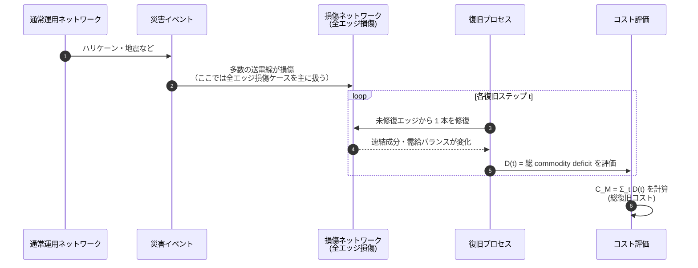

# Smith2019 の実世界モデル整理

このファイルでは、Smith et al. (2019) で想定されている
実世界の問題設定（インフラ・ネットワーク・データ）を整理する。

## 1. 対象インフラ / システム

### 1.1 主対象: 電力送電網

論文の主な適用対象は **送電網（transmission power grids）** である。

- ノード:
  - 発電所・変電所・需要ノード（消費者）の集合。
- エッジ:
  - これらを結ぶ送電線（transmission lines）。
- 目的:
  - 大規模災害等で多数の送電線が損傷した後、
    「どの順番で送電線を復旧するか」によって
    - 総復旧コスト
    - 復旧時間
    - 需要未満足量
    が大きく変わることをモデル化・解析すること。

### 1.2 他インフラへの一般化可能性

論文中では、モデルは以下のような他インフラにも適用し得ると述べられている：

- ガス・水道等の輸送ネットワーク
- サプライチェーンネットワーク

前提は、輸送される commodity が「交換可能」であり、
どの供給源から供給されてもよいタイプのネットワークであること。

## 2. ネットワークとしての表現

### 2.1 ノード

- ノード i は、電力システムにおける **サブステーション（変電所）または需要／供給地点**を表す。
- 各ノードには commodity demand \(d_i\) が定義される：
  - \(d_i < 0\): 純消費ノード（需要ノード）。
  - \(d_i > 0\): 純供給ノード（発電所など）。
  - \(d_i = 0\): ジャンクションノード（経路上の中継点）。
- \(d_i\) は、総需要／総供給が一定（例えば 1）となるよう正規化される。

### 2.2 エッジ

- エッジ (i, j) は **送電線／伝送線**を表す。
- モデル上は無向グラフとして扱われる。
- 本論文では、エッジ容量は十分大きいと仮定し、
  フロー制約は明示的に扱わない（需要・供給の集計のみで不足／余剰を判断）。

### 2.3 レイヤ構造

- Smith2019 は単層ネットワークを前提としており、
  Buldyrev2010 のような多層・相互依存ネットワークは直接は対象としていない。
- ただし、実データ（Shelby County 送電網）と
  構造パラメータを変えた合成電力網（Western US grid 類似）、
  完全グラフなど、複数のトポロジが対象として扱われる。

## 3. 依存関係のモデリング

### 3.1 成分内の需給バランス

Smith2019 の「依存」は、レイヤ間ではなく **成分内の需給バランス**として表現される。

- ある連結成分 \(C\) の commodity deficit:

  \[
    D_C = \sum_{i \in C} d_i
  \]

  - \(D_C < 0\): 需要過多（成分内の電力不足）。
  - \(D_C > 0\): 供給過多（成分内の電力余剰）。

復旧戦略の評価指標は、

- 連結性（LCC サイズ）ではなく、
- 時間にわたる **総 commodity deficit**（需要未満足＋供給過多）の積分値

として定式化される。

### 3.2 他インフラとの暗黙の依存

- 論文本文では、電力と他インフラの明示的な相互依存は扱っていないが、
  - 実世界の復旧では電力・通信・水道など複数インフラが絡むこと、
  - recovery percolation を拡張することでこれらを扱える可能性
  が議論されている。

## 4. 実データの構造

### 4.1 Shelby County 送電網

実データのケーススタディとして、以下のネットワークが使われる：

- Shelby County, Tennessee の送電網。

特徴（論文記述より）：

- ノード:
  - 9 個の供給ノード（発電・変電所）
  - 37 個の需要ノード
  - 14 個のジャンクションノード（\(d_i = 0\)）
- エッジ:
  - \(E = 76\) 本の送電線。
- データ出典:
  - Gonzalez et al. による td-NDP モデル用データ（論文 refs 22, 23, 30 など）。

復旧シナリオ:

- 初期状態として「全エッジが損傷している」ケースを主に扱う。
- 各ステップごとに 1 本の損傷エッジが修復される。
- 復旧コストは、各ステップにおける commodity deficit を時間積分した値として定義される。

### 4.2 合成電力網・完全グラフ

復旧メカニズムの一般性と構造特性の影響を調べるため、
次のようなネットワークも用いられる：

- 完全グラフ:
  - \(N = 10^4\) ノード。
  - 任意のノード対が潜在エッジ。
  - td-NDP では扱えないサイズであるため、recovery percolation のみ適用。
- 合成電力網:
  - Western US grid の統計的性質（クラスタリング係数、代数的連結度 \(\lambda_2\)、平均距離など）を模した生成モデル。
  - 構造的冗長性・長距離リンクの割合・供給ノードの割合などを変え、
    復旧コストや復旧時間への影響を解析。

### 4.3 本リポジトリでの表現への示唆

Smith2019 は具体的なファイル形式までは規定していないが、
本リポジトリでシナリオ化する際には、例えば：

- `nodes.csv`:
  - 列例: `node_id`, `node_type` (supplier/consumer/junction), `demand`, `x`, `y`, ...
- `edges.csv`:
  - 列例: `src`, `dst`

のような形式で表現し、

- `demand` 列を \(d_i\) に対応させる
- `node_type` に基づいて \(d_i\) の符号や分布を決める

といった前処理を行うことで、Smith2019 の実世界モデルに沿ったデータを扱えるようにする想定である。

## 5. 図解（Mermaid）

### 5.1 成分内の需給バランスのイメージ

```mermaid
flowchart LR
    subgraph ComponentC[連結成分 C]
        S[(供給ノード<br/>d_i > 0)]
        J[(ジャンクション<br/>d_k = 0)]
        D[(需要ノード<br/>d_j < 0)]
    end

    S --- J --- D

    ComponentC --> DC[成分の commodity deficit<br/>D_C = Σ d_i]
    DC -->|D_C < 0| Under[需要過多<br/>(undersupply)]
    DC -->|D_C > 0| Over[供給過多<br/>(oversupply)]
```

### 5.2 災害から復旧までの流れ


