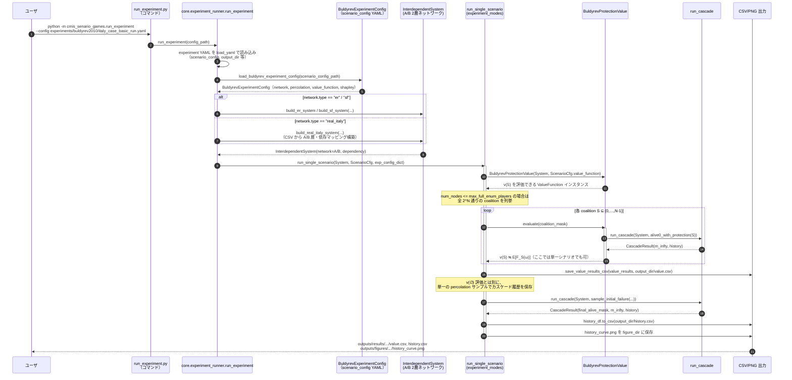
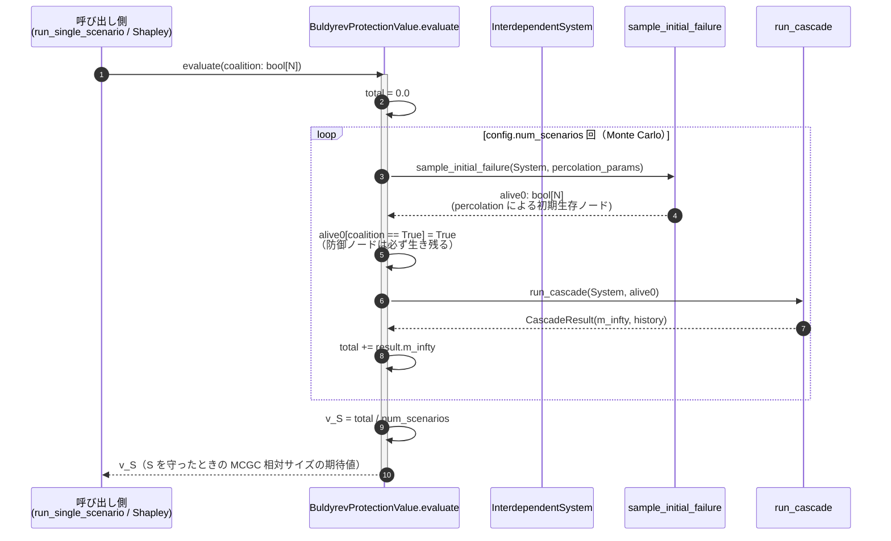
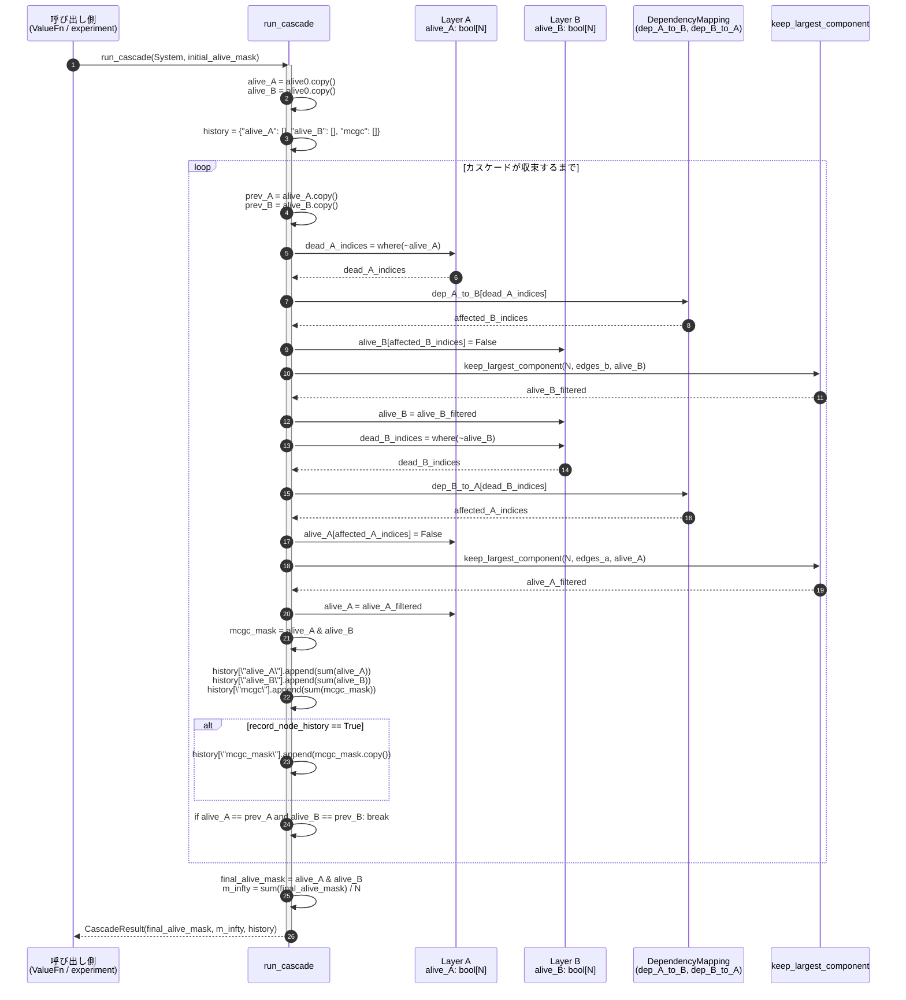

# Buldyrev et al. (2010) シナリオ設計

本ドキュメントは、Buldyrev et al. (2010)  
「Catastrophic cascade of failures in interdependent networks」シナリオの

- 共通フレームワーク（プレイヤー → v → 貢献度）上での位置づけ
- 数理モデルと実装モジュールとの対応関係
- 代表的な設定（ER / Scale-free / 実ネットワーク）

を整理する。

共通部分（ドメインモデル、Shapley アルゴリズム等）は  
`docs/design_cmis_senario_games.md` を参照のこと。

---

## 1. 共通フロー上での位置づけ

### 1.1 プレイヤー

Buldyrev2010（Protection 型）では、基本的に

- プレイヤー = 各ノード（もしくは、2 層ネットワークのノードペア (A_i, B_i)）

と解釈する。

- 実装上は、`0..N-1` のノード ID をプレイヤー ID とみなし、
  `coalition: np.ndarray[bool]` のインデックスと一致させる。
- `coalition[i] = True` であれば「ノード i（またはペア i）が防護対象 S に含まれる」と解釈する。

### 1.2 特性関数 v(S)

Buldyrev2010 / Protection の特性関数 v(S) は、

- `S` を防護対象ノード集合としたとき、
- ランダムな初期故障（percolation）と連鎖故障（cascading failure）の結果として得られる
  giant mutually connected component (MCGC) の相対サイズを性能指標とし、
- その期待値を取ったもの：

\\[
v(S) = \\mathbb{E}_\\omega[ F_S(\\omega) ]
\\]

として定義する。ここで `F_S(ω)` は、1 回のシミュレーションで得られた MCGC の相対サイズ。

実装上は、`src/cmis_senario_games/scenarios/buldyrev2010/value_protection.py` で
次のような形の `ValueFunction` を用意する：

```python
@dataclass
class BuldyrevProtectionConfig:
    percolation: PercolationParams
    num_scenarios: int
    performance_metric: str = "mcgc_size"  # デフォルト MCGC 相対サイズ


class BuldyrevProtectionValue(ValueFunction):
    game_type = GameType.PROTECTION

    def __init__(self,
                 system: InterdependentSystem,
                 config: BuldyrevProtectionConfig):
        self.system = system
        self.config = config

    def evaluate(self, coalition: np.ndarray) -> float:
        """
        coalition[i] = True のノードは「常に生き残る」と解釈。
        Monte Carlo により v(S) を近似。
        """
        total = 0.0
        for _ in range(self.config.num_scenarios):
            alive0 = sample_initial_failure(self.system, self.config.percolation)
            alive0[coalition] = True  # 防護
            result = run_cascade(self.system, alive0)
            total += result.m_infty
        return total / self.config.num_scenarios
```

ここで、

- `sample_initial_failure` と `run_cascade` は、共通フレームワーク側の
  「パーコレーション + カスケードエンジン」（v(S) 内部ロジック）に属する。
- `BuldyrevProtectionValue` は、それらを組み合わせて **Protection 型の v(S) を実現するシナリオ固有の部分** である。

より意味ベースに整理すると、v(S) は次の量の期待値として解釈できる：

- 「S のノードにだけ事前防護投資を行ったとき、
  ランダムな初期故障と連鎖故障を経た **最終状態の MCGC（相互連結巨大成分）の相対サイズ**」

1 回分のシミュレーション（あるシナリオ ω に対する `F_S(ω)`）の流れは、おおまかに次の通り：

1. **初期 percolation のサンプリング**  
   - 各ノード（正確にはノードペア (A_i, B_i)）ごとに、生残確率 `p` などに従って
     「最初の攻撃で落ちるかどうか」を乱数で決め、`alive0` として保持する。
2. **防護集合 S の反映**  
   - `coalition[i] = True` であるノード i については、初期攻撃から保護されているとみなし、
     `alive0[i] = True` に上書きして「必ず初期状態では生き残る」ようにする。
   - これにより、「どこを守れば、最終的な連鎖崩壊の規模がどの程度変わるか」を比較できる。
3. **Buldyrev 型カスケードの実行** (`run_cascade`)  
   - 2 層ネットワーク A, B と 1:1 依存関係 (A_i ↔ B_i) に対し、次を反復する：
     - A 層で死んだノードに依存している B 層ノードを停止（A→B 依存）
     - B 層の生き残りノードからなるグラフについて、**最大連結成分のみ** を残し、それ以外を機能停止とみなす
     - B 層で死んだノードに依存している A 層ノードを停止（B→A 依存）
     - A 層についても同様に、最大連結成分のみを残す
   - A/B の alive マスクが変化しなくなるまで繰り返すことで、
     依存・連結性を考慮した「安定した最終状態」が得られる。
4. **MCGC のサイズ計算**  
   - 最終状態で「A でも B でも生きているノードペア」の集合が MCGC に対応し、
     そのサイズを全ノード数で割ったものが `result.m_infty` となる。
   - これが 1 シナリオ ω に対する `F_S(ω)` であり、
     「S を守ったときに最終的に機能するノードペアの割合」を意味する。
5. **モンテカルロ平均としての v(S)**  
   - 上記 1〜4 を `num_scenarios` 回だけ繰り返し（初期故障パターンを毎回ランダムに変える）、
     得られた `F_S(ω_1), …, F_S(ω_M)` の単純平均を v(S) ≃ `E[F_S(ω)]` とみなす。

Italy case の `italy_case_basic_run.yaml` などで `mode: "single_run"` を指定した場合、
この v(S) の評価結果が `outputs/results/buldyrev2010/italy_case_study/basic_run/value.csv` の
`v_value` 列として出力される。また、単一シナリオのカスケード履歴は
`history.csv` に保存され、各ステップにおける A/B 層の生存ノード数や MCGC の推移を確認できる。

### 1.3 貢献度指標

プレイヤーと v(S) が決まれば、共通アルゴリズムに渡して貢献度を計算できる：

- `estimate_shapley(value_fn, num_players, config)`
  - プレイヤー = ノードまたはノードペア
  - `value_fn` = `BuldyrevProtectionValue` インスタンス
  - 戻り値: 各プレイヤーの Shapley 値（防護投資における限界レジリエンス貢献度）
- 必要なら、これに基づいて `rank_players_lexcel` などで順位付けする。

---

## 2. モデル概要

Buldyrev2010 の数理モデル（概要）は以下の通り：

- 2 層（A, B）の相互依存ネットワーク。
- 各層は N ノード、同一 ID 空間 {0, …, N-1}。
- 依存リンクは 1:1 双方向（A_i ↔ B_i）。
- ノード故障は percolation（生残確率 p）と cascading failure（相互依存カスケード）によって決定。
- 性能指標:
  - giant mutually connected component (MCGC) の相対サイズ `m_infty`
  - 臨界値 p_c

これらは `InterdependentSystem` と `CascadeResult` を通じて実装に反映される。

### 2.1 ノード ID とレイヤの関係

実装上、「ノード ID」「レイヤ」「プレイヤー」の対応は以下のように整理される。

- `MultiLayerNetwork`（`core/network_model.py`）は
  - 各レイヤを `NetworkLayer` として保持し
  - すべてのレイヤが **同じノード ID 空間 {0,…,N-1} を共有** していると仮定する。
- Buldyrev2010 シナリオでは
  - レイヤ `"A"` = 物理インフラ（例: 電力系統）
  - レイヤ `"B"` = 通信インフラ
  - 両者とも `num_nodes = N` で、ノード ID は 0 〜 N-1
  - `NetworkLayer.edges` は `(u, v)` 形式の無向エッジ列（0-based ノード ID）で格納される。
- `InterdependentSystem`（`core/interdependency.py`）は
  - `network: MultiLayerNetwork`
  - `dependency: DependencyMapping`
  のペアで「相互依存システム」を表す。

ここで、**プレイヤー ID = 0..N-1** は、実質的に

- `i` 番目のプレイヤー ⇔ レイヤ A のノード `A_i`
  - 依存マッピングにより、対応する B 層ノード `B_{dep_A_to_B[i]}` とペアになっている

という解釈になる（ER/SF のように `dep_A_to_B[i] = i` の場合は、`(A_i, B_i)` が自然なノードペア）。

まとめると：

- **内部表現**:
  - A 層ノード: インデックス `0..N-1`
  - B 層ノード: インデックス `0..N-1`
  - 依存関係: `dep_A_to_B[i] = j`, `dep_B_to_A[j] = i`
- **ゲーム理論側（v(S), Shapley）**:
  - プレイヤー i = 「A 層ノード i と、その依存先 B 層ノード」の組（ノードペア）
  - `coalition[i] = True` は「プレイヤー i に対応するノードペアを防御する」と読む。

### 2.2 DependencyMapping の仕様

`core/interdependency.py` の `DependencyMapping` は、2 層 A, B の 1:1 依存を

- `dep_A_to_B: np.ndarray[int]`  長さ N
  - `dep_A_to_B[i] = j` は「A_i が B_j に依存する」ことを意味する。
- `dep_B_to_A: np.ndarray[int]`  長さ N
  - `dep_B_to_A[j] = i` は「B_j が A_i に依存する」ことを意味する。

という 2 本の配列で表現する。Buldyrev2010 では

- 依存は **完全 1:1**（すべてのノードがちょうど 1 つの相手とペア）
- したがって理想的には

  \[
    \forall i: dep\_B\_to\_A[dep\_A\_to\_B[i]] = i,\quad
    \forall j: dep\_A\_to\_B[dep\_B\_to\_A[j]] = j
  \]

  が成り立つことを期待する（実装では `build_real_italy_system` 等でサイズ・被覆のチェックを行う）。

具体例：

- ER / SF のビルダ (`build_er_system`, `build_sf_system`) の場合
  - `_build_identity_dependency(n)` を使い、`dep_A_to_B = dep_B_to_A = [0, 1, ..., N-1]`
  - ノードペアは単純に `(A_0, B_0), ..., (A_{N-1}, B_{N-1})`
- real_italy のビルダ (`build_real_italy_system`) の場合
  - CSV `italy_dep_mapping.csv` から `(power_id, comm_id)` 列を読み取り
  - 任意の 1:1 対応 `(A_i, B_j)` を許す（i と j が一致するとは限らない）。
  - それでも「プレイヤー i」は一貫して `A_i` を起点に解釈する（B 側は依存配列経由で紐付け）。

このように、**ゲーム理論側（v(S)）は常に A 層のインデックスを基準** にしつつ、  
物理的な依存関係は `DependencyMapping` の中に閉じ込める構造になっている。

### 2.3 Buldyrev 型カスケード `run_cascade` の実装レベル仕様

`core/cascade_engine.py` の `run_cascade` は、Buldyrev2010 における  
相互依存カスケードをほぼそのままコード化したもので、以下の状態変数を持つ：

- 入力:
  - `initial_alive_mask: np.ndarray[bool]`（形 `(N,)`）
    - 「percolation＋防御を適用した後、どの ID が初期状態で動いているか」
    - このマスクは A/B 共通の「ノードペア単位の状態」とみなす。
- 内部状態:
  - `alive_A: np.ndarray[bool]`（A 層ノードが機能しているか）
  - `alive_B: np.ndarray[bool]`（B 層ノードが機能しているか）
  - 初期値は `alive_A = alive_B = initial_alive_mask.copy()`
- 出力:
  - `final_alive_mask = alive_A & alive_B`
    - 「A/B 両方で生きているノードペア」のマスク
  - `m_infty = final_alive_mask.sum() / N`
    - MCGC（相互連結巨大成分）の相対サイズ
  - `history: Dict[str, Any]`
    - `alive_A`, `alive_B`, `mcgc`（各ステップのノード数）
    - オプションで `mcgc_mask`（各ステップの MCGC マスク）も含む。

アルゴリズムの一巡（1 ステップ）は次のように書ける：

```python
alive_A = alive0.copy()
alive_B = alive0.copy()

while True:
    prev_A = alive_A.copy()
    prev_B = alive_B.copy()

    # 1. A -> B 依存
    dead_A = np.where(~alive_A)[0]
    alive_B[dep_A_to_B[dead_A]] = False

    # 2. B 層で GCC のみ残す
    alive_B = keep_largest_component(N, edges_b, alive_B)

    # 3. B -> A 依存
    dead_B = np.where(~alive_B)[0]
    alive_A[dep_B_to_A[dead_B]] = False

    # 4. A 層で GCC のみ残す
    alive_A = keep_largest_component(N, edges_a, alive_A)

    # 5. MCGC 計測
    mcgc_mask = alive_A & alive_B
    history["mcgc"].append(mcgc_mask.sum())
    # record_node_history=True の場合は history["mcgc_mask"] にも mcgc_mask を積む

    # 6. 収束判定
    if np.array_equal(alive_A, prev_A) and np.array_equal(alive_B, prev_B):
        break
```

ポイント：

- **連結性フィルタ（keep_largest_component）** は、各層ごとに
  - 「今生きているノードのみからなる部分グラフ」を取り出し
  - その中の最大連結成分に含まれないノードを一括で「機能停止」とみなす。
- 依存伝播（A→B, B→A）は「相手が死んだら自分も死ぬ」ルール：
  - A 層の死ノードの集合から、`dep_A_to_B` を通じて B 層の死ノード集合が増える。
  - その後 B 層で連結性フィルタが掛かることで、さらに死が伝播しうる。
- この 1〜4 を繰り返し、A/B の alive マスクが変化しなくなったところで停止する。

`CascadeResult.history` の各キーの意味と型は以下：

- `"alive_A"`: `List[int]`  
  各ステップで `alive_A.sum()` を記録（A 層で生きているノード数）
- `"alive_B"`: `List[int]`  
  B 層で生きているノード数
- `"mcgc"`: `List[int]`  
  `alive_A & alive_B`（MCGC）のノード数
- `"mcgc_mask"`: `List[np.ndarray[bool]]`（`record_node_history=True` のときのみ）  
  各ステップにおける MCGC のノード集合（後述の timeline 可視化で利用）

### 2.4 Percolation + 防御 v(S) との結びつき

1. **percolation**（`core/percolation.py`）
   - `PercolationParams(survival_prob=p, random_seed=...)`
   - `sample_initial_failure(system, params)` は
     - `num_nodes = system.network.num_nodes` に対し
     - 一様乱数 `u[i] ~ U(0,1)` をサンプルして `u[i] < p` なら `alive0[i] = True`
     - 結果として `(N,)` の `alive0` ブール配列を返す。
2. **防御集合 S の適用**
   - `coalition: np.ndarray[bool]` を受け取り

     ```python
     alive0 = sample_initial_failure(system, percolation)
     alive0[coalition] = True
     ```

   - これにより、「S に含まれるノードペアは必ず初期状態では生きている」
     という Protection 型の前提が実装される。
3. **カスケードとの統合**
   - 上記 `alive0` を `run_cascade(system, alive0)` に渡すことで、
     percolation + 相互依存カスケード + 巨大連結成分フィルタが一気通貫で実行される。
   - `result.m_infty` を Monte Carlo 平均したものが v(S)。

この一連の流れが、1.2 節の `BuldyrevProtectionValue.evaluate()` に閉じ込められている。

---

## 3. 実装マッピング

本シナリオは、共通フレームワークのモジュールに対して次のように対応付けられる。

### 3.1 コアモジュールとの対応

- ネットワーク構造:  
  `src/cmis_senario_games/core/network_model.py`
- 依存関係:  
  `src/cmis_senario_games/core/interdependency.py`
- 初期故障（percolation）:  
  `src/cmis_senario_games/core/percolation.py`
- カスケードダイナミクス:  
  `src/cmis_senario_games/core/cascade_engine.py`

### 3.2 シナリオ固有モジュール

`src/cmis_senario_games/scenarios/buldyrev2010/` 以下に Buldyrev2010 向けロジックを集約する。

#### 3.2.1 `network_definition.py`

- 2 層のネットワークを構築する責務を負う。
- 代表的な関数：

```python
def build_er_system(n: int, k_avg: float, seed: int) -> InterdependentSystem:
    ...


def build_sf_system(n: int, lambda_: float, k_min: int, seed: int) -> InterdependentSystem:
    ...


def build_real_italy_system(power_nodes_path: str,
                            power_edges_path: str,
                            comm_nodes_path: str,
                            comm_edges_path: str,
                            dep_mapping_path: str) -> InterdependentSystem:
    ...
```

- ER / Scale-free / Random regular / 実ネットワーク（イタリア停電）など、
  論文で扱うネットワークファミリーをここに閉じ込める。

#### 3.2.2 `config_schema.py`

- `configs/buldyrev2010/*.yaml` の構造を dataclass で定義。
- 例：`er_default.yaml` のスキーマ

```yaml
scenario_name: "buldyrev2010_er_protection"
game_type: "protection"
network:
  type: "er"
  num_nodes: 50000
  avg_degree: 4.0
  seed: 42
percolation:
  survival_prob: 0.8
  random_seed: 123
value_function:
  num_scenarios: 100
  performance_metric: "mcgc_size"
shapley:
  num_samples: 500
  random_seed: 999
```

#### 3.2.3 `value_protection.py`

- 前述の `BuldyrevProtectionValue` および `BuldyrevProtectionConfig` を提供し、
  Protection 型特性関数 v(S) を実際に実装する。

#### 3.2.4 `visualization.py`

- Buldyrev 的な図を再現するための可視化ユーティリティ：
  - (p) vs MCGC サイズ
  - (p) vs 存在確率（P∞）
  - ノード別 Shapley 値ヒートマップ（地理配置図 or 度数別）
  - 特定の防御パターン S に対して「どのノードが壊れたか」の例を 2 層ネットワーク上に表示

```python
def plot_pc_curve(results_df: pd.DataFrame, output_path: str):
    """
    x: p, y: MCGC size / existence probability
    """


def plot_node_importance_shapley(phi: np.ndarray,
                                 network: InterdependentSystem,
                                 output_path: str):
    """
    ノード Shapley をネットワーク上に可視化。
    """


def plot_defense_failure_example(system: InterdependentSystem,
                                 coalition_mask: np.ndarray,
                                 percolation: PercolationParams,
                                 output_path: str):
    """
    防御パターン S（coalition_mask）を 1 つ固定し、
    そのもとでの percolation + カスケードの 1 サンプルに対して
    「どのノードが生き残り / 壊れたか」を 2 層ネットワーク上に色分け表示する。
    """


def plot_defense_failure_timeline(history: dict,
                                  output_path: str):
    """
    `run_cascade(..., record_node_history=True)` の history を受け取り、
    時間ステップ × ノードのヒートマップとして
    「各ノードペアが MCGC に属しているか (1) / 既に落ちているか (0)」
    を可視化する。
    """
```

あわせて、コマンドラインから「実験設定を指定して防御パターンの例を 1 発描画」する
簡易 CLI も用意する：

- `pyproject.toml` のエントリ: `buldyrev-visualize-defense`
- 使用例（Italy case basic run）:

```bash
poetry run buldyrev-visualize-defense \
  --experiment experiments/buldyrev2010/italy_case_basic_run.yaml
```

挙動は以下の通り：

- `--experiment` で渡された YAML（例: `italy_case_basic_run.yaml`）を読み込み、
  - `scenario_config` からネットワーク（ER / SF / real_italy）と percolation パラメータを構築
  - `output_dir/value.csv` を読み込んで、保存済みの coalition 列（`node_0` 〜）から防御パターン S を復元
- どの coalition を描画するかは
  1. CLI の `--coalition-id` で明示指定があればそれを優先
  2. なければ experiment YAML 内の `visualization.coalition_id` を参照（あれば）
  3. いずれも無ければ `value.csv` に含まれる coalition の中からランダムに 1 つを選ぶ
- 選ばれた coalition S に対して percolation + カスケードを 1 回だけ実行し、
  - `figure_dir/defense_example_<coalition_id>.png`:
    2 層ネットワーク上に「どのノードが壊れたか」の最終状態を色分け表示
  - `figure_dir/defense_timeline_<coalition_id>.png`:
    縦軸ノード index、横軸カスケードステップのヒートマップとして、
    各ノードペアが MCGC に属しているかどうか（= どのタイミングで落ちたか）を可視化
    （`run_cascade(..., record_node_history=True)` の履歴から生成）

これにより、たとえば Italy case で

- 「空集合 S = ∅」の振る舞いを固定で見たい場合：  
  `experiments/buldyrev2010/italy_case_basic_run.yaml` に

  ```yaml
  visualization:
    coalition_id: "coalition_0"
  ```

  を追加しておけば、`poetry run buldyrev-visualize-defense --experiment ...` のたびに
  同じ防御パターン（= 無防御）の例が描画される。
- 特に指定しない場合は、実験で評価済みの coalition 群の中からランダムに 1 つ選ばれ、
  「ある防御パターンのもとでどこが壊れたか」の例が毎回ランダムに得られる。

#### 3.2.5 `postprocess_metrics.py`

- 実験結果から、
  - 推定された臨界値 (p_c)
  - 分布別脆弱性比較（ER vs SF vs RR）
  を集計する。

```python
def estimate_pc_from_results(results_df: pd.DataFrame) -> float:
    ...


def summarize_v_results(results_df: pd.DataFrame) -> pd.DataFrame:
    """
    coalition / node ごとの v 値の一覧を生成。
    """
```

---

## 4. デフォルト設定と実験定義

### 4.1 デフォルト設定（configs）

代表的な設定は `configs/buldyrev2010/*.yaml` に記述する。

- `er_default.yaml`: ER ネットワーク + 防護型ゲーム
- `sf_default.yaml`: Scale-free ネットワーク + 防護型ゲーム
- `italy_case_study.yaml`: イタリア停電ネットワーク（将来実装予定）

### 4.2 実験定義（experiments）

実験定義は `experiments/buldyrev2010/*.yaml` に記述し、
共通ランナー `core/experiment_runner.py` から実行する。

- `er_pc_sweep.yaml`:
  - `percolation.survival_prob` の値を変化させ、p と MCGC サイズの関係や p_c 近傍の挙動を調べる。
- `node_importance_shapley.yaml`:
  - ノード（またはノードペア）の Shapley 値を評価し、レジリエンスへの貢献度ランキングを得る。
- `italy_case_basic_run.yaml`:
  - Italy case（real_italy ネットワーク）で、単一シナリオ v(S) を評価する最小実験。
  - `mode: "single_run"` として
    - N が小さい場合（デフォルトでは `max_full_enum_players <= 16`）は、
      すべての S ⊆ {0,…,N-1} について v(S) を評価し、
    - N が大きい場合は S = ∅（全ノード「守らない」）だけを評価し、
    - いずれの場合も 1 回のカスケード履歴を保存する。

代表的な出力：

- `outputs/results/buldyrev2010/italy_case_study/basic_run/value.csv`
  - 列：`scenario_name`, `game_type`, `coalition_id`, `node_0`, ..., `node_{N-1}`, `v_value`
  - Italy case（N=12）のデフォルトでは、全 2^12 通りの coalition が行として並ぶ。
    - `coalition_id = "coalition_0"` が S = ∅（全 `node_i = False`）に対応。
    - `coalition_id = "coalition_k"` のビット表現が、各 `node_i` 列のフラグに対応。
  - `v_value` が「対応する S を守ったときの MCGC 相対サイズの期待値」に相当。
- `outputs/results/buldyrev2010/italy_case_study/basic_run/history.csv`
  - 列：`step`, `alive_A`, `alive_B`, `mcgc`
  - Buldyrev 型カスケードの各ステップにおける生存ノード数・MCGC サイズ
- `outputs/figures/buldyrev2010/italy_case_study/history_curve.png`
  - x: step, y: alive_A / alive_B / mcgc の 3 曲線

---

## 5. 実装順序（Buldyrev2010 パターン）

Buldyrev2010 シナリオを実装する際の推奨ステップは次の通り：

1. **core/ の基盤クラス・エンジン実装**
   - `NetworkLayer`, `InterdependentSystem`
   - `percolation.py`, `cascade_engine.py`（Buldyrev 型カスケードの実装を含む）
   - `ValueFunction` 抽象, `contribution_shapley.py`
2. **scenarios/buldyrev2010/ 実装**
   - `network_definition.py`（ER / SF / RR / 実ネットワーク）
   - `value_protection.py`（防護型ゲーム v(S)）
   - `visualization.py`, `postprocess_metrics.py`
3. **configs/buldyrev2010/*.yaml の定義と experiment_runner からの実験実行**
   - `config_schema.py` で YAML を dataclass にマッピング。
4. **Shapley 値計算 + 可視化（ノード重要度ランキング）**
   - `estimate_shapley` + `plot_node_importance_shapley` などを組み合わせる。
5. **本ドキュメントの充実**
   - 論文の数理モデル
   - 実装上の対応関係
   - パラメータのデフォルト値・推奨値
   を追記し、再利用しやすいテンプレートとする。

---

## 6. TODO

- 論文からの数式・パラメータの抜き出し（特に p_c の解析的近似等）。
- MCGC 計算・カスケードアルゴリズムの pseudo code 化と検証。
- 実データ（イタリア停電）の入手元と前処理仕様の整理。
- 「ノード vs ノードペア」をプレイヤー定義として切り替えるための設定項目・実装方針の整理。

---

## 7. 処理シーケンス（Mermaid 図）

ここでは、Buldyrev2010 シナリオにおける主な処理の流れを  
Mermaid のシーケンス図で整理する。

- 7.1 では「実験 YAML から value.csv / history.csv ができるまで」の全体像。
- 7.2 では「1 つの v(S) を評価するとき」の Percolation + カスケードの流れ。
- 7.3 では「カスケード内部（2 層ネットワーク）の 1 ステップ」の詳細。

### 7.1 実験ランナー（single_run）の全体像

`experiments/buldyrev2010/italy_case_basic_run.yaml` などを  
`run_experiment()` で実行したときの、主要コンポーネント間のやりとり：



### 7.2 v(S) = E[F_S(ω)] 評価のシーケンス

ここでは、1 つの防御集合 S に対して `BuldyrevProtectionValue.evaluate()` が  
どのように v(S) を近似しているかを、Percolation + カスケードの観点から描く。



### 7.3 カスケード（2 層ネットワーク）1 ステップのシーケンス

最後に、`run_cascade()` の「A 層 / B 層 / 依存マッピング / 連結成分フィルタ」の  
やりとりを、1 ステップ分にフォーカスして図示する。



これらのシーケンス図を合わせて読むことで、

- 「どこまでがシナリオ共通ロジック（percolation / cascade_engine）か」
- 「どこからが Buldyrev2010 固有（network_definition / value_protection / visualization）か」
- 「2 層ネットワークと 1:1 依存の扱いが、どのレイヤで・どの変数として出てくるか」

といった構造を、コードを直接追うことなく把握できるようにしている。
